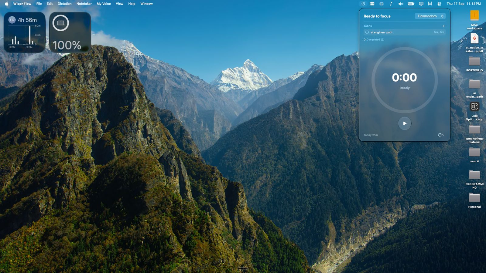
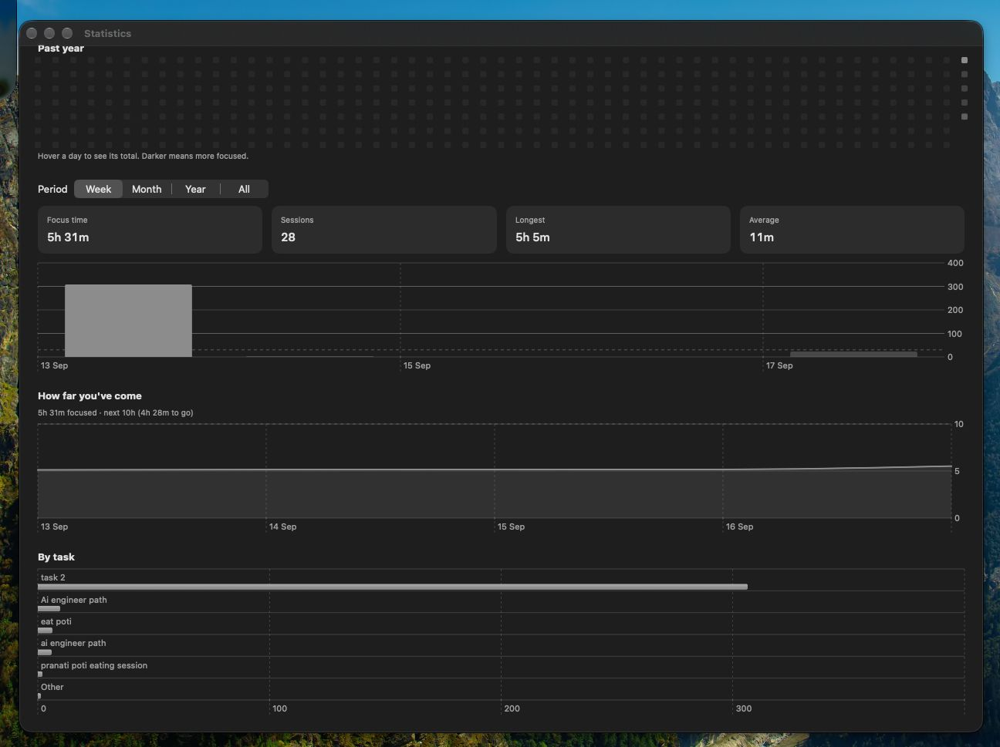

# Flowmodora

A quiet little timer that lives in your Mac's menu bar, so you can focus on
one thing at a time — and actually see where your hours go.

## What it is

Most timer apps want to be the center of attention: a big window, a loud
UI, something you have to switch to and stare at. Flowmodora is the
opposite. It sits in your menu bar, out of the way, and just keeps time
while you get on with your work. Click it, pick a task, hit play, and go
back to what you were doing. The timer keeps ticking in the corner of your
screen — a quiet companion instead of another thing demanding your
attention.

The idea borrows from two well-known ways of managing focus:

- **Pomodoro** — the classic technique. Work in fixed intervals (25
  minutes by default), take a short break, repeat, and take a longer break
  every few rounds.
- **Flowmodoro** — a gentler, more modern take built for deep work: you
  don't set a timer in advance, you just start working and let the clock
  count *up*. Whenever you naturally stop, your break is calculated from
  how long you actually focused (e.g. 1 minute of break for every 5 minutes
  worked). It respects the fact that focus doesn't always fit into neat
  25-minute boxes.

Flowmodora gives you both, side by side, and remembers what you were doing
even if you close the popover, sleep your laptop, or quit the app entirely
— your session picks up right where it left off.

It's also **local-first**: every task, session, and stat lives on your Mac.
No account, no sign-up, no internet connection required. If you ever want
your data synced across machines, an optional, opt-in sync is there — but
the app never asks you for it, and never needs it.

## What it looks like

<p align="center">
  
</p>

<p align="center"><i>Click the menu bar icon and this is what greets you — your tasks, a live timer ring, and today's total, without ever leaving your current window.</i></p>

<p align="center">
  
</p>

<p align="center"><i>A proper statistics window for when you want the bigger picture: focus time, session count, streaks, and a breakdown by task, over a week, month, year, or all time.</i></p>

## Features

- **Two focus modes** — Pomodoro (fixed work/break intervals, configurable
  rounds) and Flowmodoro (count up, break scales with how long you worked).
- **A task list, right in the popover** — create tasks, pick one to focus
  on, check them off, and see today's and lifetime totals per task at a
  glance.
- **A live menu-bar clock** — the running timer is visible in your menu
  bar at all times, so you never have to open the app to check where you
  stand. Right-click it for quick pause/resume/stop controls without
  opening the popover at all.
- **Survives everything** — quitting the app, sleeping your Mac, or just
  closing the popover doesn't lose your place. The timer is reconstructed
  from real timestamps, not a countdown that resets.
- **Real statistics** — today, this week, this month, this year, or all
  time, plus a per-task breakdown and a focus streak, computed entirely on
  your device.
- **Gentle nudges** — optional notifications and sounds when an interval
  ends, launch-at-login, and light/dark/system appearance, all in Settings.
- **Your data, your machine** — everything above works fully offline.
  Optional Supabase sync exists for people who want their history on more
  than one Mac, but it's opt-in and the app never depends on it.

## Under the hood

Flowmodora is a native macOS app, built with a deliberately small,
"boring on purpose" architecture — the kind of app that's easy to reason
about six months later.

```
SwiftUI MenuBarExtra / windows
              ↓ user actions
AppStore (@Observable, main-actor app state)
       ↙              ↓                ↘
TimerEngine      SwiftData          system services
(timestamp math)  (local database)   (notifications, login item)
              ↓
       StatisticsEngine
       (pure, local-only calculation)
```

**Platform & UI**
- 100% **SwiftUI**, using the newest `MenuBarExtra(.window)` API to get a
  fully native, glass-material popover instead of a hand-rolled
  `NSStatusItem` + `NSPopover` — while still dropping into raw **AppKit**
  where SwiftUI doesn't reach yet (a local `NSEvent` monitor powers the
  right-click context menu on the status item, since `MenuBarExtra` has no
  secondary-click API of its own).
- **Swift Charts** renders the statistics graphs.
- **Liquid Glass** (`.glassEffect`) throughout the popover's controls, with
  identity-preserving transitions so buttons *morph* between states (play →
  pause → stop) instead of cross-fading.
- The app is `LSUIElement`, so it never touches the Dock — a true
  background utility.

**State & data**
- **SwiftData** is the single source of truth for tasks, sessions, and
  settings — four small, intentionally minimal models, no premature
  generality.
- The *running* timer is not SwiftData: it's a small `Codable` snapshot in
  `UserDefaults`, restored on launch. This means the running timer survives
  a force-quit or a crash, without ever treating a UI-recovery blob as if
  it were the real database.
- **No decrementing counters, anywhere.** Every timer value — the ring, the
  menu-bar text, a task's elapsed time — is derived live from real
  timestamps (`accumulatedFocus + (now - resumedAt)`). Waking a sleeping
  Mac or reopening the app after days away still shows the correct number
  immediately, because nothing was ever "counting" while the app wasn't
  running — it's recomputed from *when things actually happened*.
- One shared 1&nbsp;Hz clock (an async `Task` loop) drives every ticking
  view in the app, and — this is the detail that took real engineering
  effort — **it only exists while a timer is actually running**. The
  instant you pause or stop, the loop is cancelled outright. Measured cost
  while idle: effectively 0% CPU and near-zero wakeups, so leaving the app
  open all day costs you nothing.
- **`@Observable`** (the modern replacement for `ObservableObject`) is used
  throughout for state, so views only re-render the small slice of the
  screen that actually changed.

**Sync (optional)**
- Supabase (Postgres + Row Level Security) as an *optional* remote, added
  through an outbox pattern: local writes are always immediate and
  authoritative, and a background outbox retries idempotent upserts to the
  server whenever a connection and sign-in exist. If Supabase is
  unreachable or never configured, nothing about the core app changes.
- Auth is email one-time-code, backed by Postgres RLS policies as the real
  authorization boundary — not by keeping any secret client-side.

**Craft details**
- A `WidgetExtension` target for a future home-screen widget.
- A real test suite (`flowmodoroTests`) that runs with zero network,
  zero Supabase credentials, and zero notification permissions required —
  the timer's timestamp math and statistics calculations are validated in
  complete isolation from the outside world.
- Full internal docs in [`docs/ARCHITECTURE.md`](docs/ARCHITECTURE.md) and
  [`docs/STATUS.md`](docs/STATUS.md), including a running decisions log of
  *why* things were built this way, not just what was built.

## Build it yourself

Open `flowmodoro/flowmodoro.xcodeproj` in Xcode and run the `flowmodoro`
scheme on macOS. No API keys or accounts are needed — it runs fully
offline out of the box.
